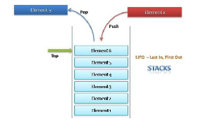

# Lab04 - Hermetyzacja w języku Java

## **Zadanie 0.**
Przeczytać przed przystąpieniem do rozwiązywania zadań z konspektu:
Przypomnienie informacji o hermetyzacji: [LINK](http://edu.pjwstk.edu.pl/wyklady/poj/scb/)

## **Zadanie 1.**
Dla wszystkich zadań z poprzedniego konspektu `(Lab. 03.)` dodać hermetyzację.

## **Zadanie 2.**
Zaprojektuj i utwórz klasę, która opisuje pozycję książkową w księgarni. Książki cechują się
następującymi właściwościami: `tytuł`, `autor`, `liczba stron`, `rok wydania`, `cena`. Zastosuj enkapsulację
pól w klasie, przy czym uwzględnij, że tylko cena książki może się zmieniać w czasie, a pozostałe
atrybuty są niezmienne (tylko do odczytu). Utwórz przykładowe obiekty i pokaż w jaki sposób
można dostać się do pól obiektu poprzez metody.

## **Zadanie 3 .**
Zaprojektuj klasę symulującą działanie struktury stosu. W ramach klasy występują następujące
prywatne pola: n-elementowa tablica liczb całkowitych reprezentująca stos, wskaźnik stosu jako
liczba całkowita. Wskaźnik stosu wskazuje element ze szczytu stosu. Utwórz metody:
umieszczającą element na szczycie stosu `push` oraz ściągającą wartość ze szczytu stosu `pop`.
Zadbaj o to aby w razie przepełnienia stosu nie można było umieścić wartości na stosie, a w razie
stosu pustego nie można było ściągnąć danej ze stosu. Zauważ, że instrukcje `push` i `pop`
zachowują się jak `get` i `set`. Utwórz konstruktor, którego argumentem jest rozmiar stosu. W
ciele konstruktora dokonaj inicjalizacji n-elementowej tablicy reprezentującej stos. Pamiętaj, że
instrukcja `push` i `pop` zmieniają odpowiednio wskaźnik stosu.

 

## **Zadanie 4.**
Zdefiniuj klasę opisującą datę. Zastanów się nad wyborem wewnętrznej reprezentacji dat. Zdefiniuj
metody pozwalające na odczytywanie bieżącej daty i przestawianie jej o jeden tydzień w przód i w
tył. Zadbaj o dobranie odpowiednich modyfikatorów dostępu do składowych.

## **Zadanie 5.**
Zdefiniuj klasę `Pracownik` (podobnie do klasy osoba z wykładu, dodając jeszcze tekstową
informację o zajmowanym przez pracownika stanowisku). Następnie zdefiniuj klasę `Firma`, która
by przechowywała w tablicy spis wszystkich pracowników (możesz założyć, że liczba
pracowników nie przekracza 100). Zdefiniuj metody dodawania nowych pracowników do firmy
oraz wypisywania aktualnego spisu pracowników. Zastanów się, jak przy tym ostatnim zadaniu
rozdzielić odpowiedzialności pomiędzy obie klasy.

## **Zadanie 6.**
Zdefiniuj klasę `Liczba`, która przechowuje w tablicy cyfry liczby dziesiętnej. Zdefiniuj operacje
wypisywania liczby, nadawania jej wartości (w postaci parametru konstruktora będącego napisem)
oraz mnożenia przez liczbę typu int. W przypadku gdy w czasie mnożenia okaże się, że tablica jest
za mała, procedura mnożąca powinna kopiować jej zawartość do większej. Zdefiniuj wreszcie
metodę `silnia`, która policzy silnię zadanej jako parametr liczby typu `int`.
